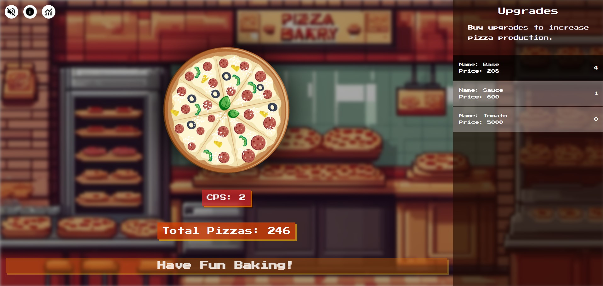
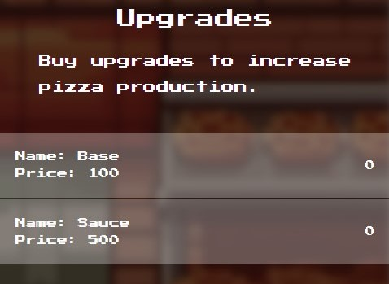

# Pizza Clicker

## What is Pizza Clicker?

**Pizza Clicker** is a clicker game based off of the popular mobile and steam game, _Cookie Clicker_. Build up your Pizza Empire and rise above your competition!

## How To Play

1. Click the pizza in the center of the screen to produce pizzas.
2. The current **Total Pizzas** are the currency of the game. You can use it to buy upgrades.
3. If a **Golden Pizza** appears, click it to temporarily increase the production rate.

## Features

### Upgrades

- Buy Upgrades from the **upgrade panel** on the right side of the screen.
- Upgrades increases your automatic Clicks Per Second _(CPS)_ as well as increasing the value of each click.
- You start off with three available upgrades. Once you have bought all of them, **you will unlock more**.
- The price currency of the upgrades is determined by your **total pizzas**.

### Story

Cutscenes will appear at certain points throughout the game. They are triggered if the **total amount of pizzas earned** _(not the total you currently have)_ at certain points.

Progress through the the story to see what Calithas has to say. Calithas will just generally talk to you and update you on how you are doing.

## **IMPORTANT NOTE**

This game is my first real vanilla _HTML, CSS and JavaScript_ Project. There are many bugs that will appear after you reach a certain amount of pizza.  This game is not finished and there will be issues.
